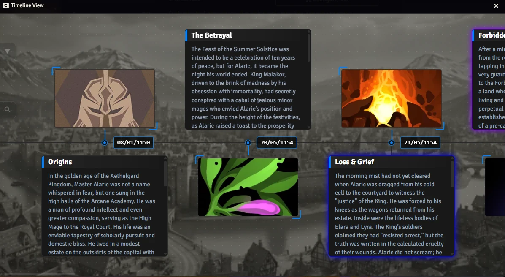
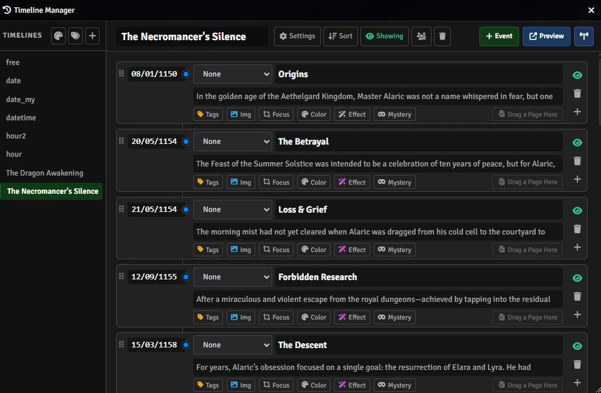

# Timeline Builder

**Timeline Builder** transforms your world's history into a stunning, interactive horizontal scroll. Transform dry dates and notes into an immersive experience that players will love to explore. Perfect for tracking campaign arcs, world lore, or character backstories.

<p align="center"></p>

## ✨ Key Features

- **🎨 Immersive Visualization**: Display events in a sleek, "zig-zag" horizontal layout. Features drag-to-scroll navigation and a built-in lightbox for inspecting maps and artwork.
- **✨ Dynamic Visual Effects**: Make legendary events stand out! Apply animated effects like **Glow**, **Pulse**, **Neon**, **Glitch**, and **Chroma** to specific entries.
- **🛠️ Total Customization**: Style your timeline to match your setting. Choose from different **Line Styles** (Solid, Dashed, Rough/Ink), **Dot Shapes**, and custom colors for every element.
- **🕵️ Mystery Mode**: Tease your players with "Redacted" information. Show that an event occurred but hide the specific date, description, or image until the big reveal.
- **🔗 Deep Integration**: Connect events directly to **Journal Entries**. A single click transports players from the timeline to the full lore page.
- **🏷️ Powerful Organization**: Use **Tags** to categorize events (e.g., "War", "Politics", "Personal") and let players filter the view to see exactly what matters to them.
- **👑 GM Control**: Manage what players see with granular visibility settings. Hide entire timelines or specific events, and use **Broadcast** to show a timeline to all connected players instantly.

## 🚀 Getting Started

1.  **Access**: Go to the **Notes Layer** (left toolbar) and click the **Timeline** (clock) icon.

<p align="center"></p>

You can also use macros:

```js
Timeline.Open();
```

```js
Timeline.Manage();
```

2.  **Create (GM)**: Use the Manager to build timelines, add events, and drag-and-drop to reorder.

<p align="center"></p>

3.  **Customize**: Pick your theme colors, line styles, and apply special effects to key moments.
4.  **Share**: Players can open the viewer to explore the history you've created!

## 🚀 Installation

Install via the Foundry VTT Module browser or use this manifest link:

```js
https://raw.githubusercontent.com/brunocalado/timeline-builder/main/module.json
```

## ⚖️ Credits and License

* **Code License:** GNU GPLv3.

* **Assets:** AI Audio and images provided are [CC0 1.0 Universal Public Domain](https://creativecommons.org/publicdomain/zero/1.0/).